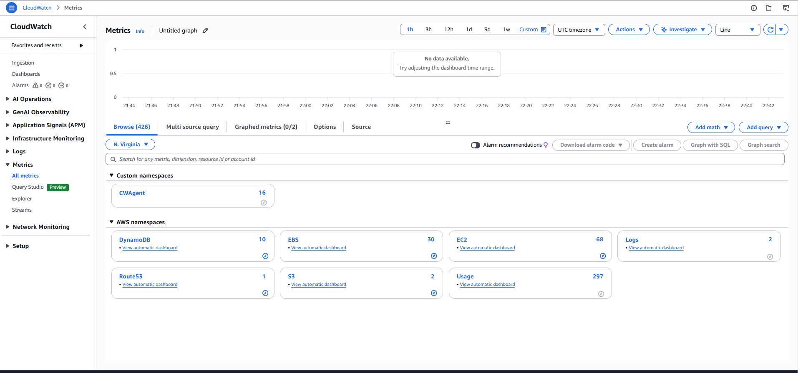
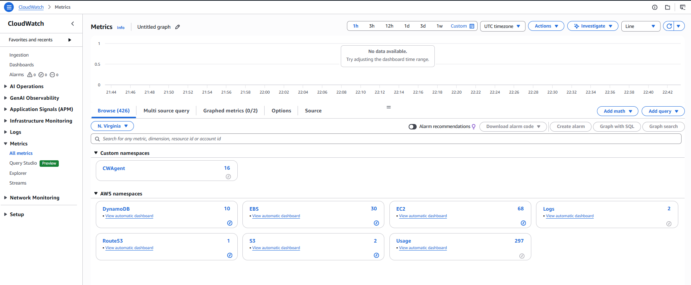
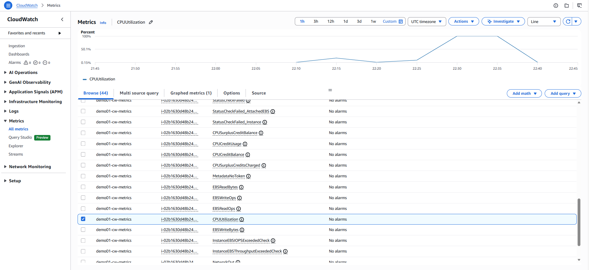
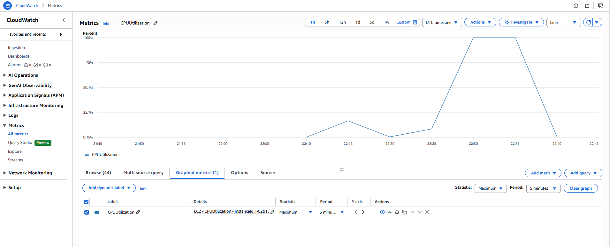
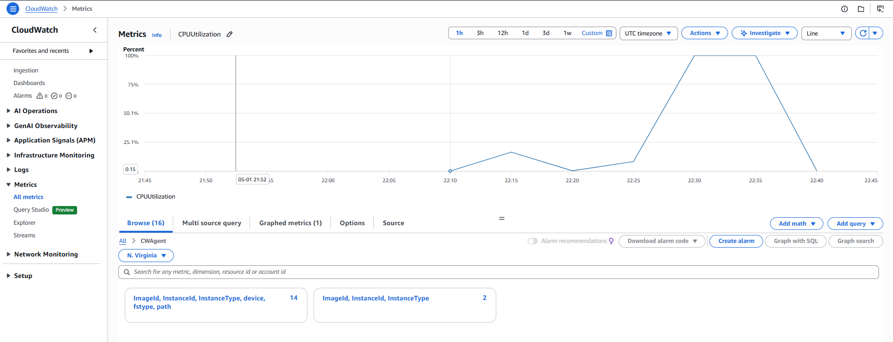
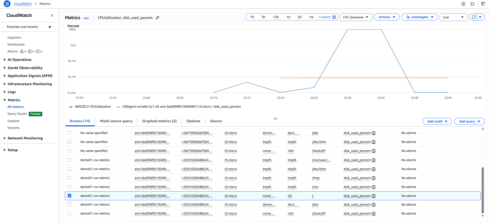
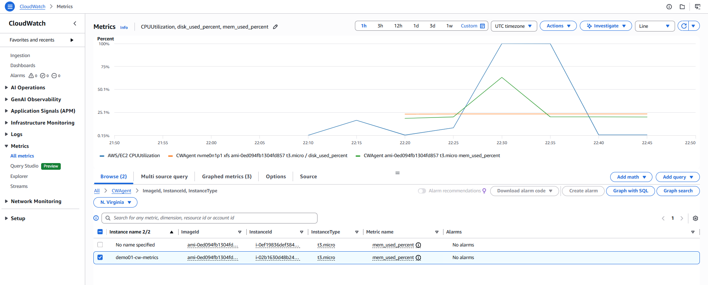
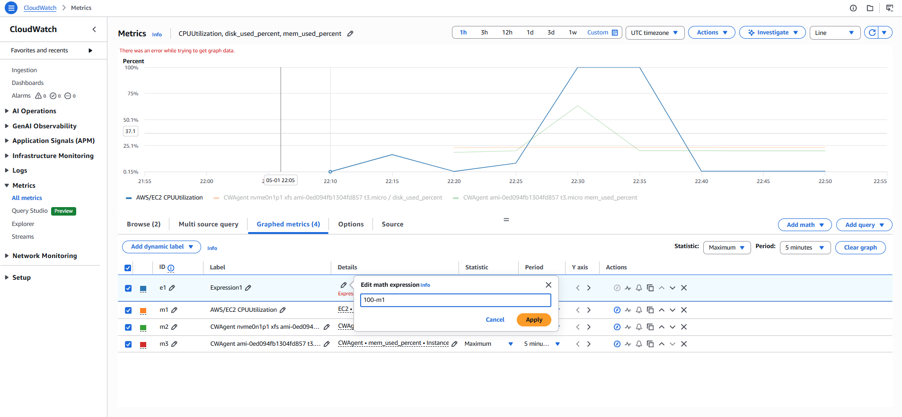
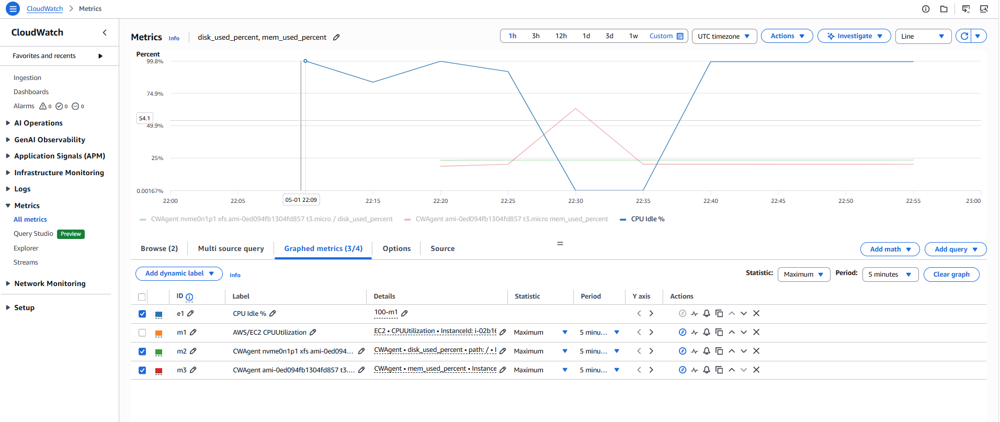
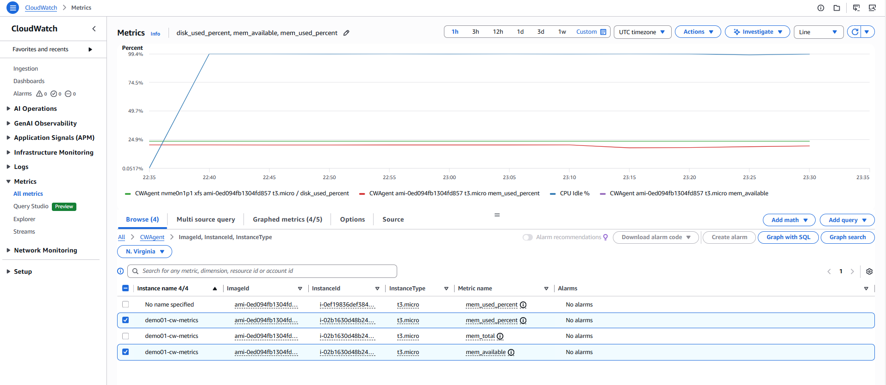

# Demo 01: CloudWatch Metrics & EC2 Monitoring — Four Golden Signals in Practice

## Overview

Every production system generates signals — CPU spikes, memory pressure, request
latency, disk exhaustion. Without a way to observe these signals in real time,
you are operating blind. CloudWatch Metrics is AWS's native telemetry collection
engine — it receives, stores, and surfaces the numeric measurements your AWS
resources emit automatically, and your applications emit on demand.

This demo builds a realistic scenario: you are the SRE on-call for a web
application running on EC2. The app is under load. Your job is to instrument the
instance, collect the right metrics, spot the problems, and build the operational
visibility your team needs.

**Real-world scenario:**
A Node.js API server is deployed on an EC2 instance. Traffic is increasing.
The team has no visibility into CPU, memory, disk, or network. You need to set up
observability from scratch — starting with metrics — before the next release goes
out.

**What this demo covers:**
- Why CloudWatch Metrics exist and how they relate to Google's Four Golden Signals
- EC2 default metrics — what AWS collects automatically and why
- EC2 detailed monitoring — why 1-minute granularity matters in incidents
- CloudWatch Agent — why you need it for memory, disk and custom metrics
- Metric namespaces, dimensions, and statistics — how to read metrics correctly
- EC2 Instance Connect — secure shell access without SSH key management
- CloudWatch Metrics console — navigating and graphing metrics
- AWS CLI commands for metric retrieval and verification
- Metric Math — combining metrics to calculate derived signals
- Cost implications and Free Tier boundaries

---

## Google's Four Golden Signals — The Framework Behind This Demo

Google's SRE Book defines four signals that, if measured, give you sufficient
visibility into any service. Every metric in this demo maps to one of these:

```
┌─────────────────────────────────────────────────────────────────┐
│              Google's Four Golden Signals                       │
├──────────────┬──────────────────────────────────────────────────┤
│ LATENCY      │ How long requests take                           │
│              │ EC2 metric: (custom) response time               │
│              │ Bad latency hides inside averages — track p99    │
├──────────────┼──────────────────────────────────────────────────┤
│ TRAFFIC      │ How much demand is on your system                │
│              │ EC2 metric: NetworkIn, NetworkOut, CPUUtilization│
├──────────────┼──────────────────────────────────────────────────┤
│ ERRORS       │ Rate of failed requests                          │
│              │ EC2 metric: StatusCheckFailed (instance/system)  │
├──────────────┼──────────────────────────────────────────────────┤
│ SATURATION   │ How full your service is                         │
│              │ EC2 metric: mem_used_percent, disk_used_percent  │
│              │ (requires CloudWatch Agent)                      │
└──────────────┴──────────────────────────────────────────────────┘
```

> **Why this framework?** Teams that monitor based on symptoms (Golden Signals)
> catch real problems. Teams that monitor based on causes (individual metrics)
> get alert fatigue. Start with the signals, then drill into causes.

---

## Symptoms vs Causes in Observability

In observability, **symptoms** and **causes** are not the same thing — and
confusing them is one of the biggest operational mistakes in distributed systems.

### Symptom — What You Observe

A symptom is an externally visible signal that something is wrong. It is what
your observability stack (metrics, logs, traces) shows you. Think of symptoms
as effects, not explanations.

```
Examples of symptoms:
  High latency on an API (p95 latency ↑)
  Increased error rate (5xx responses rising)
  CPU usage spike
  Pod restarts in Kubernetes
  Queue backlog growing
```

These surface through metrics (Prometheus counters/gauges, CloudWatch),
logs (error messages, warnings), and traces (slow spans, failed requests).

Key property: symptoms tell you **that** something is wrong, not **why**.

### Cause — Why It Happened

A cause is the underlying reason that produced the symptom. This is what
you discover through debugging, correlation, and analysis.

```
Examples of causes:
  Memory leak in application    → pod restarts
  Slow database queries         → high API latency
  Misconfigured autoscaler      → CPU saturation
  Network partition             → timeouts
  Bad deployment                → spike in 500 errors
```

### Symptom → Cause: Real-World Scenarios

```
Scenario 1: API latency spike
  Symptom : p95 latency = 3s
  Causes  : DB connection pool exhaustion
            Downstream service slowness
            Thread pool saturation

Scenario 2: Kubernetes pod restarts
  Symptom : Pod restarting frequently
  Causes  : OOMKilled (memory limit exceeded)
            CrashLoopBackOff due to app bug
            Liveness probe misconfiguration

Scenario 3: High error rate
  Symptom : 20% of requests returning 500
  Causes  : New buggy deployment
            Dependency outage
            Schema mismatch
```

### Why This Distinction Matters

Alerting on individual metrics (causes) alone leads to alert fatigue —
you fire on every CPU blip. Alerting on Golden Signals (symptoms) catches
what users actually experience. The SRE workflow is:

```
Symptom → Investigation → Correlation → Cause → Fix
```

### The Three Pillars Bridge the Gap

```
Metrics → Detect symptoms      ("something is wrong")
Logs    → Provide context      ("what happened")
Traces  → Show request flow    ("where it broke")

Together → infer the cause     ("why it happened")
```

### Practical Mental Model

```
Symptom = Smoke   (what observability tools show you)
Cause   = Fire    (what engineering effort must find and fix)
```

### Common Mistake

```
"CPU is high"                        ❌  (symptom — not actionable alone)
"Infinite loop causing CPU spike"    ✅  (cause — actionable)

"Pod restarted"                      ❌  (symptom)
"Memory leak triggered OOMKill"      ✅  (cause)
```

---

## CloudWatch in the Observability Ecosystem

If you come from an open source background, the fastest way to understand
CloudWatch's scope is to map it to the tools you already know.

```
┌──────────────────────────────────────────────────────────────────────────┐
│           Open Source Stack  ←→  AWS CloudWatch Equivalent               │
├──────────────────────────────┬───────────────────────────────────────────┤
│  Prometheus                  │  CloudWatch Metrics                       │
│  · scrapes /metrics endpoint │  · receives push from services + agent    │
│  · stores time-series data   │  · stores time-series data                │
│  · PromQL for queries        │  · Metric Math for queries                │
│  · pull model                │  · push model                            │
├──────────────────────────────┼───────────────────────────────────────────┤
│  Alertmanager                │  CloudWatch Alarms                        │
│  · evaluates alert rules     │  · evaluates threshold rules              │
│  · routes to PagerDuty/Slack │  · routes via SNS → email/Slack/PagerDuty │
│  · silences, inhibition      │  · composite alarms for grouping          │
├──────────────────────────────┼───────────────────────────────────────────┤
│  Loki                        │  CloudWatch Logs                          │
│  · log aggregation           │  · log aggregation                        │
│  · LogQL for queries         │  · Logs Insights (SQL-like queries)       │
│  · label-based indexing      │  · metric filters on log patterns         │
├──────────────────────────────┼───────────────────────────────────────────┤
│  Grafana                     │  CloudWatch Dashboards                    │
│  · connects to any datasource│  · CloudWatch data only (by default)      │
│  · multi-source, plugin-rich │  · AWS Managed Grafana closes this gap    │
├──────────────────────────────┼───────────────────────────────────────────┤
│  Jaeger / Tempo              │  AWS X-Ray                                │
│  · distributed tracing       │  · distributed tracing                    │
│  · trace spans, service maps │  · trace spans, service maps              │
├──────────────────────────────┼───────────────────────────────────────────┤
│  OpenTelemetry Collector     │  AWS Distro for OpenTelemetry (ADOT)      │
│  · vendor-neutral pipeline   │  · AWS-supported OTel distribution        │
│  · receives/processes/exports│  · sends to X-Ray + CloudWatch            │
└──────────────────────────────┴───────────────────────────────────────────┘
```

### Three Critical Differences

**1. Push vs Pull — and What It Means for Your Network Architecture**

```
Prometheus Pull Model:
  Prometheus Server ──── HTTP GET /metrics ────► Target App
  · App must expose a reachable HTTP endpoint
  · Prometheus must have network access to every target
  · Private subnets require extra work (push gateway, VPC peering)
  · Ephemeral targets (Lambda, Fargate) may be missed between scrapes

CloudWatch Push Model:
  App / Agent / AWS Service ──── HTTPS PutMetricData ────► CloudWatch
  · No inbound port needed on the app
  · Works from private subnets (only outbound HTTPS required)
  · Works from Lambda / Fargate — SDK pushes on each invocation
  · Use CloudWatch VPC Endpoint to keep traffic off public internet
```

**Network setup for each model:**

```
Prometheus in AWS (pull):
  ┌────────────────────────────────────────────────────────┐
  │  Prometheus EC2 (public subnet)                        │
  │  must reach target:                                    │
  │   · Security group must allow inbound :9090 on target  │
  │   · Or deploy push-gateway in private subnet           │
  │   · Or use EKS service discovery (more complex)        │
  └────────────────────────────────────────────────────────┘

CloudWatch push (this demo):
  ┌────────────────────────────────────────────────────────┐
  │  EC2 (private OR public subnet)                        │
  │  CloudWatch Agent → outbound HTTPS 443 to:            │
  │   · monitoring.us-east-1.amazonaws.com (public)        │
  │   · OR VPC Endpoint com.amazonaws.us-east-1.monitoring │
  │  No inbound rules needed on the instance               │
  └────────────────────────────────────────────────────────┘
```

> **Rule of thumb:** If your workload is ephemeral (Lambda, Fargate, spot)
> or lives in a private subnet without inbound access, CloudWatch push is
> significantly simpler. Prometheus pull works best for stable, long-running
> services with predictable network topology — typically Kubernetes.

**2. Native AWS integration depth**

```
Prometheus + Grafana  → instrument and wire everything yourself
CloudWatch            → EC2, RDS, Lambda, ECS, EKS, S3, API Gateway,
                        DynamoDB auto-publish metrics with zero config
```

**3. Multi-source dashboarding**

```
Grafana (self-managed)  → combines Prometheus, Loki, Postgres,
                          Datadog, CloudWatch on one dashboard
CloudWatch Dashboards   → CloudWatch data only by default
AWS Managed Grafana     → Grafana flexibility + native AWS auth
```

### Where CloudWatch Wins

- **Zero-ops** — no Prometheus server to size, scale, or maintain
- **Auto-coverage** — every AWS resource emits metrics from creation
- **Push from anywhere** — private subnets, Lambda, Fargate all work
- **Alarm → Action** — native hooks to Auto Scaling, Lambda, SSM

### Where the Open Source Stack Wins

- **Portability** — identical across AWS, GCP, Azure, on-premises
- **PromQL expressiveness** — more powerful than Metric Math
- **Multi-source dashboards** — one Grafana spans every data source
- **Cost at scale** — self-managed Prometheus cheaper at very high volumes

### The Real-World Corporate Pattern

```
AWS Services → CloudWatch Metrics + Logs     (automatic, zero config)
     +
Applications → Prometheus (on EKS)           (flexible, PromQL)
     +
Everything   → AWS Managed Grafana           (unified dashboards)
     +
Traces       → AWS X-Ray or Jaeger           (distributed tracing)
```

You will build toward this unified stack progressively across this demo series.

---

## Understanding CloudWatch Metrics — Core Concepts

### What a Metric Is

A CloudWatch metric is a time-ordered set of data points. Each data point has:
- **Timestamp** — when the measurement was taken
- **Value** — the numeric measurement
- **Unit** — Percent, Bytes, Count, Seconds, etc.

```
CPUUtilization metric for instance i-0abc123:

  Timestamp           Value    Unit
  ─────────────────────────────────
  2025-01-15 10:00    12.5     Percent
  2025-01-15 10:05    18.2     Percent
  2025-01-15 10:10    87.4     Percent   ← spike!
  2025-01-15 10:15    91.1     Percent
  2025-01-15 10:20    22.3     Percent
```

### Namespaces, Dimensions — Compared to Prometheus

```
┌────────────────┬──────────────────────────┬───────────────────────────────┐
│ Concept        │ Prometheus               │ CloudWatch                    │
├────────────────┼──────────────────────────┼───────────────────────────────┤
│ Namespace      │ Job / scrape target      │ AWS/EC2, CWAgent, Custom/App  │
│                │ e.g. job="node_exporter" │ Top-level grouping by source  │
│                │                          │ Reserved: AWS/* (do not write)│
├────────────────┼──────────────────────────┼───────────────────────────────┤
│ Metric name    │ node_cpu_seconds_total   │ CPUUtilization                │
│                │ http_requests_total      │ mem_used_percent              │
├────────────────┼──────────────────────────┼───────────────────────────────┤
│ Dimensions     │ Labels                   │ Key-value pairs               │
│                │ {instance="10.0.0.1",    │ InstanceId=i-0abc123          │
│                │  cpu="0",mode="idle"}    │ InstanceType=t3.micro         │
│                │ Unlimited cardinality    │ Max 30 per metric             │
├────────────────┼──────────────────────────┼───────────────────────────────┤
│ Query language │ PromQL                   │ Metric Math                   │
│                │ rate(http_req[5m])       │ m1 / m2 * 100                 │
│                │ histogram_quantile(...)  │ Less expressive than PromQL   │
├────────────────┼──────────────────────────┼───────────────────────────────┤
│ Statistics     │ avg(), max(), rate()     │ Average, Maximum, Sum,        │
│                │ computed inline in query │ p99, tm99 — chosen at graph   │
└────────────────┴──────────────────────────┴───────────────────────────────┘
```

**Namespace usage in practice:**
```
AWS/EC2      → EC2 instance metrics (CPU, network, disk I/O, status)
AWS/RDS      → RDS database metrics (connections, latency, IOPS)
AWS/Lambda   → Lambda metrics (invocations, errors, duration)
CWAgent      → CloudWatch Agent metrics (mem_used_percent, disk_used_percent)
Custom/MyApp → Your application's custom metrics (request count, error rate)
```

> **Rule:** Never write to `AWS/*` namespaces — reserved for AWS services.
> The Prometheus equivalent: you do not create metrics in the `go_*` or
> `process_*` reserved namespaces that client libraries own.

**Dimension example:**
```
Namespace:  AWS/EC2
MetricName: CPUUtilization
Dimension:  InstanceId = i-0abc123   ← this instance only

Without dimension → query returns ALL instances aggregated
With dimension    → isolated to exactly one instance

Prometheus equivalent:
  cpu_usage{instance="10.0.0.1"}  vs  cpu_usage (all instances)
```

### EC2 Default Metrics vs CloudWatch Agent Metrics

```
┌────────────────────────────────────────────────────────────────┐
│  EC2 DEFAULT METRICS (AWS/EC2 namespace)                       │
│  Collected by AWS hypervisor — no agent — free                 │
├─────────────────────────┬──────────────────────────────────────┤
│  CPUUtilization         │ % CPU — most watched metric          │
│  NetworkIn / NetworkOut │ Bytes received / sent                │
│  DiskReadBytes          │ Bytes read from instance store       │
│  DiskWriteBytes         │ Bytes written to instance store      │
│  StatusCheckFailed      │ 1 = either check failing             │
│  StatusCheckFailed_Inst │ OS/software level                    │
│  StatusCheckFailed_Sys  │ Hardware/hypervisor level            │
└─────────────────────────┴──────────────────────────────────────┘

┌────────────────────────────────────────────────────────────────┐
│  CLOUDWATCH AGENT METRICS (CWAgent namespace)                  │
│  Collected inside OS — agent required — small cost             │
├─────────────────────────┬──────────────────────────────────────┤
│  mem_used_percent       │ % RAM in use — saturation signal     │
│  disk_used_percent      │ % disk per path/device               │
│  mem_available          │ Available RAM in bytes               │
│  disk_free              │ Free disk bytes                      │
│  cpu_usage_user         │ CPU in user space (your app)         │
│  cpu_usage_system       │ CPU in kernel space                  │
│  cpu_usage_idle         │ CPU doing nothing — headroom         │
└─────────────────────────┴──────────────────────────────────────┘
```

> **Why doesn't AWS collect memory by default?**
> The hypervisor observes what it controls: CPU cycles, network packets,
> block I/O. Memory management happens inside the guest OS kernel — the
> hypervisor cannot see it. The CloudWatch Agent reads `/proc/meminfo`
> from inside the OS. This is the exact same reason `node_exporter` exists
> in Prometheus — you need a process inside the OS to expose OS-level metrics.

### Monitoring Granularity — 5-Minute vs 1-Minute

```
Basic Monitoring (default, free):
  Data points every 5 minutes
  A 90-second CPU spike averaged into a 5-minute bucket may disappear

Detailed CloudWatch Monitoring (enabled in this demo):
  Data points every 1 minute
  The 90-second spike is visible — alarm fires within 1 minute
  Auto Scaling reacts 5x faster
```

> **SRE best practice:** Enable detailed monitoring on all production instances.
> In the AWS console this appears as **"Detailed CloudWatch monitoring: Enable"**
> under Advanced details during instance launch.

---

## Architecture

```
┌─────────────────────────────────────────────────────────────────┐
│                        us-east-1                                │
│                                                                 │
│  ┌──────────────────────────────────────────────────────────┐   │
│  │         VPC (default) — Public Subnet                    │   │
│  │                                                          │   │
│  │  ┌──────────────────────────────────────────────────┐    │   │
│  │  │       EC2 t3.micro — IAM: EC2CloudWatchRole      │    │   │
│  │  │                                                  │    │   │
│  │  │  ┌──────────────┐   ┌──────────────────────────┐ │    │   │
│  │  │  │  stress-ng   │   │  CloudWatch Agent        │ │    │   │
│  │  │  │  (CPU/mem    │   │  reads /proc/meminfo     │ │    │   │
│  │  │  │   load sim)  │   │  reads df (disk)         │ │    │   │
│  │  │  └──────────────┘   └────────────┬─────────────┘ │    │   │
│  │  │                                  │               │    │   │
│  │  │  AWS Hypervisor observes:        │ HTTPS push    │    │   │
│  │  │  CPU / Network / Block I/O ──────┤ (port 443)    │    │   │
│  │  └──────────────────────────────────┼───────────────┘    │   │
│  │                                     │                    │   │
│  │           Security Group: demo01-sg │                    │   │
│  │           Inbound: TCP 22           │                    │   │
│  │           Outbound: HTTPS 443 ──────┘                    │   │
│  └──────────────────────────────────────────────────────────┘   │
│                              │                                  │
│                              ▼                                  │
│              ┌──────────────────────────────────┐               │
│              │       Amazon CloudWatch           │               │
│              │                                  │               │
│              │  ┌────────────┐  ┌─────────────┐ │               │
│              │  │  AWS/EC2   │  │  CWAgent    │ │               │
│              │  │  namespace │  │  namespace  │ │               │
│              │  │  (auto)    │  │  (agent)    │ │               │
│              │  └────────────┘  └─────────────┘ │               │
│              │       Metrics Console + Math      │               │
│              └──────────────────────────────────┘               │
└─────────────────────────────────────────────────────────────────┘
```

---

## How EC2 Metrics Are Sent to CloudWatch — Under the Hood

This is one of the most important internals to understand. It explains
why EC2 default metrics and CloudWatch Agent metrics behave differently,
why you need both, and what is actually happening on the network.

### Two Completely Separate Pipelines

```
┌─────────────────────────────────────────────────────────────────────┐
│  PIPELINE 1: EC2 Default Metrics (AWS/EC2 namespace)                │
│                                                                     │
│  Who sends it?  AWS itself — the Nitro hypervisor                   │
│  What is sent?  CPU, Network, Disk I/O, Status checks               │
│  How?           AWS internal control plane — not your network        │
│  Frequency?     Every 5 min (default) or 1 min (detailed enabled)   │
│  Agent needed?  No                                                  │
│  IAM role?      No                                                  │
│  Port 443?      No — bypasses your instance network entirely        │
└─────────────────────────────────────────────────────────────────────┘

┌─────────────────────────────────────────────────────────────────────┐
│  PIPELINE 2: CloudWatch Agent Metrics (CWAgent namespace)           │
│                                                                     │
│  Who sends it?  CloudWatch Agent daemon running inside your OS      │
│  What is sent?  mem_used_percent, disk_used_percent, cpu_usage_*    │
│  How?           PutMetricData API over HTTPS port 443               │
│  Frequency?     Every 60 seconds (configurable in agent config)     │
│  Agent needed?  Yes — must be installed and configured              │
│  IAM role?      Yes — EC2CloudWatchRole with PutMetricData          │
│  Port 443?      Yes — outbound HTTPS through your instance network  │
└─────────────────────────────────────────────────────────────────────┘
```

### Pipeline 1 — How the Hypervisor Sends EC2 Metrics

AWS EC2 runs on the **AWS Nitro System** — a custom hypervisor built by AWS.
The Nitro hypervisor sits between the physical hardware and your EC2 instance.
It has direct visibility into everything it manages and allocates:

```
Physical Server
│
├── Nitro Hypervisor
│     ├── Manages CPU scheduling  → measures CPUUtilization per VM
│     ├── Manages network cards   → measures NetworkIn / NetworkOut
│     ├── Manages block devices   → measures DiskReadBytes / DiskWriteBytes
│     └── Runs health checks      → measures StatusCheckFailed
│
└── Your EC2 instance (guest OS)
      └── Hypervisor CANNOT see inside the OS:
            How RAM is split between processes  → needs agent
            How full the filesystem is          → needs agent
            CPU breakdown (user/system/idle)    → needs agent
```

The Nitro hypervisor collects these measurements and **pushes them directly
to CloudWatch via AWS's internal control plane** — a private network path
that never touches the public internet, your security groups, or your
instance's network interface. This is why:

- You do **not** need port 443 open for EC2 default metrics
- You do **not** need an IAM role for EC2 default metrics
- Enabling "Detailed CloudWatch monitoring" simply tells the hypervisor
  to increase its push frequency from 5 minutes to 1 minute
- These metrics appear in CloudWatch even if your instance has no
  outbound internet access at all

```
EC2 Default Metrics flow:
  Nitro Hypervisor
    → AWS internal control plane (private, no public internet)
      → CloudWatch (AWS/EC2 namespace)

Your instance network:  not involved
Security group:         not involved
IAM role:               not involved
Port 443:               not involved
```

### Detailed CloudWatch Monitoring — What It Actually Does

This is a common point of confusion. Here is the precise answer:

```
Default (Detailed monitoring NOT enabled):
  EC2 metrics ARE sent to CloudWatch automatically — always
  Frequency: every 5 minutes
  Cost: FREE
  No action required from you — happens for every EC2 instance

Detailed CloudWatch Monitoring ENABLED:
  Same hypervisor, same metrics, same pipeline
  Only the frequency changes: 5 minutes → 1 minute
  Cost: $0.01 per metric per month
  Nothing else changes — no agent, no config, no IAM, no network change
```

> **Key point:** Detailed monitoring is a frequency dial, not an on/off
> switch for metric collection. EC2 metrics flow to CloudWatch regardless.
> If you never enable it, you still get CPUUtilization, NetworkIn/Out,
> DiskReadBytes, and StatusChecks — just at 5-minute intervals.

```
Think of it as:

  [Default — always on]          [Detailed enabled]
  5-min granularity        →     1-min granularity
  Free                     →     $0.01/metric/month
  Same metrics             →     Same metrics
  Same pipeline            →     Same pipeline
  No setup needed          →     One checkbox in console
```

**What you get with Detailed Monitoring (no agent):**
```
✅ CPUUtilization              (1-min intervals)
✅ NetworkIn / NetworkOut      (1-min intervals)
✅ DiskReadBytes / DiskWriteBytes  (instance store)
✅ EBSReadBytes / EBSWriteBytes    (EBS volumes)
✅ StatusCheckFailed / _Instance / _System

❌ mem_used_percent            → needs CloudWatch Agent
❌ disk_used_percent           → needs CloudWatch Agent
❌ cpu_usage_user/system/idle  → needs CloudWatch Agent
```

Detailed monitoring and the CloudWatch Agent are **completely independent**.
You can have one without the other. In production you want both.

### Pipeline 2 — How the CloudWatch Agent Sends Metrics

The CloudWatch Agent is a Go-based daemon. Here is exactly what happens
every 60 seconds:

```
Step 1: Collect (inside the OS)
  Reads /proc/meminfo         → mem_used_percent, mem_available, mem_total
  Reads filesystem stats      → disk_used_percent per mount point
  Reads /proc/stat            → cpu_usage_user, cpu_usage_system, cpu_usage_idle

Step 2: Authenticate (IMDS → STS)
  Calls http://169.254.169.254/latest/meta-data/iam/security-credentials/
  AWS STS returns temporary credentials for EC2CloudWatchRole
  Credentials auto-rotate every few hours — no manual rotation needed

Step 3: Format (PutMetricData JSON)
  {
    "Namespace": "CWAgent",
    "MetricData": [{
      "MetricName": "mem_used_percent",
      "Dimensions": [
        {"Name": "InstanceId",   "Value": "i-0abc123"},
        {"Name": "InstanceType", "Value": "t3.micro"}
      ],
      "Timestamp": "2025-01-15T10:00:00Z",
      "Value": 45.2,
      "Unit": "Percent"
    }]
  }

Step 4: Send
  Endpoint: https://monitoring.us-east-1.amazonaws.com
  API:      cloudwatch:PutMetricData
  Protocol: HTTPS / TLS 1.2+
  Port:     443 outbound

Step 5: Store
  CloudWatch stores in CWAgent namespace
  Retained 15 months
  Visible in console within ~60 seconds
```

### Both Pipelines Compared

```
┌─────────────────┬───────────────────────────┬──────────────────────────┐
│                 │  EC2 Default Metrics       │  CloudWatch Agent        │
├─────────────────┼───────────────────────────┼──────────────────────────┤
│ Sender          │ AWS Nitro hypervisor       │ Agent daemon in your OS  │
│ Network path    │ AWS internal control plane │ Your instance → HTTPS 443│
│ Endpoint        │ AWS private (internal)     │ monitoring.region.amazonaws.com│
│ Port            │ Not port 443 — internal    │ 443 outbound             │
│ IAM role needed │ No                         │ Yes                      │
│ Security group  │ Not involved               │ Outbound 443 (default ✅)│
│ Agent needed    │ No                         │ Yes                      │
│ Namespace       │ AWS/EC2                    │ CWAgent                  │
│ Frequency       │ 5 min or 1 min (detailed)  │ 60s (configurable)       │
└─────────────────┴───────────────────────────┴──────────────────────────┘
```

## CloudWatch Agent — Which Endpoint Is Used and How to Configure It

### Default Behavior

By default the agent uses the **public CloudWatch endpoint**:

```
Default endpoint:
  https://monitoring.{region}.amazonaws.com
  e.g. https://monitoring.us-east-1.amazonaws.com

Traffic path:
  EC2 instance → Internet Gateway (or NAT) → public internet → CloudWatch
```

No configuration needed — this works out of the box.

### Option 1: VPC Endpoint — Zero Agent Config Change (Recommended)

When you create a CloudWatch VPC Interface Endpoint with Private DNS enabled,
the agent config does **not change at all**. AWS handles the routing automatically:

```
How it works:
  1. Create VPC Interface Endpoint in AWS console:
       VPC → Endpoints → Create endpoint
       Service: com.amazonaws.us-east-1.monitoring
       Enable Private DNS: YES ← critical setting

  2. AWS creates a private DNS override:
       monitoring.us-east-1.amazonaws.com
       now resolves to a private IP inside your VPC
       instead of a public IP on the internet

  3. Agent config: UNCHANGED
       Agent still calls monitoring.us-east-1.amazonaws.com
       DNS now resolves to private endpoint automatically
       Traffic stays entirely within AWS — never hits public internet

Traffic path with VPC Endpoint:
  EC2 instance → VPC Endpoint (private IP) → CloudWatch
  No IGW, no NAT Gateway, no public internet
```

### Option 2: endpoint_override in Agent Config

Use this when Private DNS is not enabled, or for cross-VPC / cross-account setups:

```json
{
  "metrics": {
    "endpoint_override": "vpce-XXXXXXXXX.monitoring.us-east-1.vpce.amazonaws.com",
    "metrics_collected": {
      "mem": { "measurement": ["mem_used_percent"] },
      "disk": { "measurement": ["used_percent"], "resources": ["*"] }
    }
  }
}
```

After editing, restart the agent:
```bash
sudo /opt/aws/amazon-cloudwatch-agent/bin/amazon-cloudwatch-agent-ctl \
  -a fetch-config -m ec2 \
  -c file:/opt/aws/amazon-cloudwatch-agent/bin/config.json -s
```

### Security Groups and Outbound Port 443

**You do not need to manually add port 443.** You are correct.

AWS EC2 security groups have a default outbound rule that allows all
outbound traffic on all ports to all destinations:

```
Default security group outbound rule (created automatically):
  Type         Protocol   Port range   Destination
  All traffic  All        All          0.0.0.0/0   ✅ covers HTTPS 443
```

The CloudWatch Agent reaches `monitoring.us-east-1.amazonaws.com:443`
without any additional security group configuration in a standard setup.

**When would you need to explicitly configure outbound port 443?**

```
Scenario 1: Default outbound rule was deleted (custom hardened SG)
  Fix: Add outbound rule → HTTPS (443) → 0.0.0.0/0
       Or better: HTTPS (443) → CloudWatch IP ranges only

Scenario 2: Enterprise restrictive security group (allow-list outbound)
  Common in regulated industries — only specific ports/destinations allowed
  Fix: Add HTTPS 443 outbound → 0.0.0.0/0
       Or use CloudWatch VPC Endpoint (cleanest solution)

Scenario 3: Instance in private subnet with no NAT Gateway
  SG allows 443 but there is no route to the internet
  Fix: Create a CloudWatch VPC Endpoint
       Traffic stays inside AWS — no IGW or NAT needed
```

> **Production best practice:** Use a CloudWatch VPC Endpoint. It removes
> the internet dependency, eliminates NAT Gateway data charges for metric
> traffic, and keeps all metric data within the AWS network.

### Endpoint Summary

```
┌──────────────────────────┬───────────────────────────────────────────┐
│ Setup                    │ How agent finds the endpoint              │
├──────────────────────────┼───────────────────────────────────────────┤
│ Default (this demo)      │ Public DNS → public IP → internet         │
│                          │ No config change needed                   │
├──────────────────────────┼───────────────────────────────────────────┤
│ VPC Endpoint             │ Same DNS name — private DNS resolves      │
│ Private DNS enabled      │ to private IP inside VPC                  │
│                          │ Agent config: UNCHANGED ← easiest         │
├──────────────────────────┼───────────────────────────────────────────┤
│ endpoint_override        │ Explicit VPC endpoint URL in agent config │
│ in agent config          │ Cross-VPC or no-private-DNS setups        │
└──────────────────────────┴───────────────────────────────────────────┘
```

---

## CloudWatch Agent Configuration Wizard — All Options Explained

The wizard is an interactive tool that generates the agent JSON config file.
Understanding every prompt helps you make the right choices for different
environments. Here is every prompt, what it configures, and the recommended
answer.

### Full Wizard Prompt Reference

**OS selection**
```
On which OS are you planning to use the agent?
  1. linux   ← select for Amazon Linux, Ubuntu, RHEL, etc.
  2. windows
  3. darwin   (macOS — not used on EC2)
```

**Environment**
```
Are you using EC2 or On-Premises hosts?
  1. EC2          ← agent uses IMDS to auto-detect region and credentials
  2. On-Premises  ← agent reads from ~/.aws/credentials profile instead
```

**Run as user**
```
Which user are you planning to run the agent?
  1. cwagent  ← dedicated least-privilege user (recommended)
  2. root     ← avoid in production — more permissions than needed
  3. others   ← specify a custom user
```
> `cwagent` is created during installation. It has only the permissions
> needed to read system metrics. Running as root is a security risk.

**StatsD daemon**
```
Do you want to turn on StatsD daemon?
  1. yes  ← agent listens on UDP 8125 for custom app metrics in StatsD format
  2. no   ← skip if your application does not emit StatsD metrics
```
> StatsD is a protocol used by many application frameworks to push custom
> metrics (request counts, timings). Enable this in Demo 11 when we add
> application-level metrics. For infrastructure monitoring: no.

**CollectD**
```
Do you want to monitor metrics from CollectD?
  1. yes  ← agent reads from CollectD socket — CollectD must already be installed
  2. no   ← skip (CollectD not installed — agent would fail to start if enabled)
```
> CollectD is a legacy metrics daemon. Warning in the prompt is important —
> if you select yes without CollectD installed, the agent will not start.

**Host metrics**
```
Do you want to monitor any host metrics? e.g. CPU, memory, etc.
  1. yes  ← enables the metrics_collected section (CPU, mem, disk, net)
  2. no   ← agent collects no system metrics (log-only mode)
```
> This is the core purpose of the agent for this demo. Always yes unless
> you are using the agent purely for log collection.

**CPU per core**
```
Do you want to monitor cpu metrics per core?
  1. yes  ← separate metric per CPU core (cpu0, cpu1, cpu2...)
  2. no   ← aggregate CPU across all cores (one metric)
```
> Per-core metrics are useful for detecting uneven load distribution
> (one core pinned to 100% while others are idle — indicates single-threaded
> bottleneck). For most monitoring: aggregate (no) is sufficient and cheaper.

**EC2 dimensions**
```
Do you want to add ec2 dimensions (ImageId, InstanceId, InstanceType,
AutoScalingGroupName) into all of your metrics if the info is available?
  1. yes  ← appends InstanceId, InstanceType, ImageId to every metric
  2. no   ← metrics have no instance-level dimensions
```
> Always yes. Without InstanceId as a dimension, you cannot filter metrics
> to a specific instance in CloudWatch — all instances' metrics look identical.

**Aggregate EC2 dimensions**
```
Do you want to aggregate ec2 dimensions (InstanceId)?
  1. yes  ← drops InstanceId from dimensions — metrics aggregated across fleet
  2. no   ← keeps InstanceId — per-instance visibility maintained
```
> Choose no for per-instance monitoring (this demo and most use cases).
> Choose yes only when building fleet-level dashboards where you want
> aggregate CPU or memory across an entire Auto Scaling Group — you
> intentionally lose per-instance visibility in exchange for fleet totals.

**Collection interval / resolution**
```
Would you like to collect your metrics at high resolution (sub-minute)?
  1. 1s   ← 1-second granularity (highest cost)
  2. 10s  ← 10-second granularity
  3. 30s  ← 30-second granularity
  4. 60s  ← 1-minute granularity (default, aligns with detailed monitoring)
```

```
Standard resolution (60s — this demo):
  Minimum granularity: 1 minute
  Cost: standard CloudWatch metric pricing
  Alarm evaluation: minimum 1-minute periods
  Use for: most infrastructure monitoring

High resolution (1s, 10s, 30s):
  Sub-minute granularity
  Cost: higher — stored separately, alarmed differently
  Use for: financial systems, gaming, real-time latency SLOs
  Not needed for: general EC2 infrastructure monitoring
```

**Metrics preset — the most important choice**
```
Which default metrics config do you want?
  1. Basic     ← disk + memory only
  2. Standard  ← adds CPU, network, swap, netstat
  3. Advanced  ← adds processes, detailed mem, disk, net breakdown
  4. None      ← no host metrics — define everything manually
```

What each preset actually collects:

```
┌──────────┬────────────────────────────────────────────────────────────┐
│  BASIC   │ Minimum viable monitoring — disk + memory only             │
│  (default)│                                                           │
├──────────┼────────────────────────────────────────────────────────────┤
│  Metrics │ disk:  used_percent (all paths)                            │
│          │ mem:   mem_used_percent                                    │
│          │                                                            │
│  Config  │ "disk": {"measurement": ["used_percent"],                  │
│  output  │          "resources": ["*"]}                               │
│          │ "mem":  {"measurement": ["mem_used_percent"]}              │
│          │                                                            │
│  Good for│ Getting started, cost-sensitive environments               │
│  Missing │ mem_available, cpu breakdown, swap, netstat                │
└──────────┴────────────────────────────────────────────────────────────┘

┌──────────┬────────────────────────────────────────────────────────────┐
│ STANDARD │ Balanced monitoring — adds CPU and net metrics             │
├──────────┼────────────────────────────────────────────────────────────┤
│  Metrics │ Everything in Basic, plus:                                 │
│          │ cpu:     usage_idle, usage_iowait, usage_user,             │
│          │          usage_system                                      │
│          │ disk:    inodes_free (inode exhaustion detection)          │
│          │ diskio:  io_time, write_bytes, read_bytes, writes, reads   │
│          │ mem:     mem_used_percent (same as Basic)                  │
│          │ net:     bytes_sent, bytes_recv, packets_sent, packets_recv │
│          │ netstat: tcp_established, tcp_time_wait                    │
│          │ swap:    swap_used_percent                                 │
│          │                                                            │
│  Good for│ Most production workloads — recommended starting point     │
│  Missing │ mem_available, mem_total (still not included by default)   │
└──────────┴────────────────────────────────────────────────────────────┘

┌──────────┬────────────────────────────────────────────────────────────┐
│ ADVANCED │ Full coverage — adds process and more detailed metrics     │
├──────────┼────────────────────────────────────────────────────────────┤
│  Metrics │ Everything in Standard, plus:                              │
│          │ cpu:     usage_steal, usage_guest, usage_nice              │
│          │ disk:    used, free, total, inodes_used, inodes_total      │
│          │ diskio:  iops_in_progress, merged_reads, merged_writes     │
│          │ mem:     used, cached, buffered, available, total, free    │
│          │          ← mem_available IS included here ✅               │
│          │ net:     err_in, err_out, drop_in, drop_out                │
│          │ processes: blocked, dead, idle, running, sleeping, stopped │
│          │                                                            │
│  Good for│ Detailed troubleshooting, performance engineering          │
│  Cost    │ More metrics = higher CloudWatch cost (more metric streams)│
└──────────┴────────────────────────────────────────────────────────────┘

┌──────────┬────────────────────────────────────────────────────────────┐
│  NONE    │ No host metrics — agent collects only what you manually    │
│          │ add to the config afterward                                │
├──────────┼────────────────────────────────────────────────────────────┤
│  Good for│ Custom metric-only setups, log collection only            │
│          │ When you want full control over every metric collected     │
└──────────┴────────────────────────────────────────────────────────────┘
```

**Preset recommendation by environment:**
```
Learning / demo     → Basic    (covers key signals, minimal cost)
Dev / staging       → Standard (balanced — CPU + network visible)
Production          → Standard or Advanced (match your SLO requirements)
Custom workloads    → None + manual JSON (full control)
```

**Config confirmation**
```
Are you satisfied with the above config?
  1. yes  ← saves config and moves on
  2. no   ← returns to start of wizard

Always review the JSON the wizard shows before confirming.
The config is also saved to disk — you can edit it manually afterward.
```

**Log agent migration**
```
Do you have any existing CloudWatch Log Agent configuration file to import?
  1. yes  ← migrates settings from the older CloudWatch Logs Agent (deprecated)
  2. no   ← fresh setup (choose this for new installations)
```
> The old CloudWatch Logs Agent (Python-based) has been superseded by the
> unified CloudWatch Agent. If migrating an old instance, choose yes.

**Log files**
```
Do you want to monitor any log files?
  1. yes  ← configure log file collection (paths, log groups, streams)
  2. no   ← skip log collection for now
```
> Log collection is covered in Demo 03. For this demo choose no —
> we are focused on metrics only.

**X-Ray traces**
```
Do you want the CloudWatch agent to also retrieve X-Ray traces?
  1. yes  ← agent acts as a local X-Ray daemon collector
  2. no   ← skip tracing for now
```
> X-Ray tracing is covered in Demo 06. Choose no for this demo.

**SSM Parameter Store**
```
Do you want to store the config in the SSM parameter store?
  1. yes  ← config saved to SSM — enables fleet-wide config management
  2. no   ← config stays local on the instance only
```
> SSM Parameter Store is the production approach for managing agent config
> across many instances. For this single-instance demo choose no.
> In production with Auto Scaling Groups, store in SSM so every new
> instance automatically pulls the correct config on launch.

### After the Wizard — Where the Config Is Saved

```
Config file location: /opt/aws/amazon-cloudwatch-agent/bin/config.json

Backup of previous config (if one existed):
  /opt/aws/amazon-cloudwatch-agent/etc/backup-configs/

Start the agent with the saved config:
  sudo /opt/aws/amazon-cloudwatch-agent/bin/amazon-cloudwatch-agent-ctl \
    -a fetch-config -m ec2 \
    -c file:/opt/aws/amazon-cloudwatch-agent/bin/config.json -s
```

> **Note on wizard versions:** The wizard prompts may vary slightly between
> CloudWatch Agent versions. 
> The core flow (OS → EC2 → user → metrics preset → logs → SSM) remains consistent.Always review the generated JSON config before starting the agent the wizard shows it to you and asks for confirmation before saving.

---


## Prerequisites

- IAM user with `CloudWatchFullAccess`, `AmazonEC2FullAccess`, `IAMFullAccess`
- Default VPC in `us-east-1` (present by default in all accounts)
- AWS CLI v2 installed and configured

**Verify:**
```bash
aws sts get-caller-identity
```

---

## Lab Objectives

By the end of this demo, you will be able to:
1. ✅ Explain what CloudWatch Metrics are and how EC2 emits them
2. ✅ Enable EC2 detailed monitoring and explain why granularity matters
3. ✅ Install and configure the CloudWatch Agent for memory and disk metrics
4. ✅ Navigate the CloudWatch console to find, graph, and interpret metrics
5. ✅ Simulate CPU load and observe metric response in real time
6. ✅ Apply Metric Math to derive composite signals
7. ✅ Map observed metrics to the Four Golden Signals framework

---

## Directory Structure

```
01-cloudwatch-metrics-ec2/
├── README.md
└── scripts/
    ├── 01-create-iam-role.sh       # IAM role for EC2 → CloudWatch
    ├── 02-launch-ec2.sh            # Launch EC2 with detailed monitoring
    ├── 03-install-cwagent.sh       # CloudWatch Agent install + start
    ├── 04-simulate-load.sh         # CPU stress simulation
    └── 05-query-metrics.sh         # CLI metric queries
```

---

## Step 1: Create IAM Role for EC2

The EC2 instance needs an IAM role to push metrics to CloudWatch.
IAM roles are the current AWS-recommended and only accepted approach
for granting AWS service permissions to EC2.

### Why IAM Role and Not Access Keys?

```
Access Keys on EC2 (WRONG — never do this):
  Stored in ~/.aws/credentials on the instance
  Leaked if instance is compromised or AMI snapshot shared
  Must be manually rotated — frequently neglected
  AWS Security Hub, Trusted Advisor flag this as critical violation

IAM Role (CORRECT — only accepted approach):
  Temporary credentials via Instance Metadata Service (IMDS)
  Automatically rotated by AWS every few hours
  Attached to the instance resource, not a user identity
  Every API call audited in CloudTrail
  Revoked instantly by detaching the role
```

> **How does it work under the hood?**
> When the CloudWatch Agent calls `PutMetricData`, it first fetches
> temporary credentials from the Instance Metadata Service (IMDS) at
> `169.254.169.254`. AWS STS (Security Token Service) issues short-lived
> credentials that expire in a few hours and are automatically refreshed.
> To go deeper on this mechanism, explore **AWS STS** and **IMDS** — they
> underpin all AWS service-to-service authentication. CloudTrail records
> every credential use, giving you a complete audit trail.

### Console Steps

**Navigate to:** IAM → Roles → Create role

1. **Trusted entity type:** AWS service → **Use case:** EC2 → Next
2. **Attach policy:** search and select `CloudWatchAgentServerPolicy`
   - Permits: `cloudwatch:PutMetricData`, `ec2:DescribeTags`,
     `logs:CreateLogGroup`, `logs:PutLogEvents`
3. **Role name:** `EC2CloudWatchRole` → Create role ✅

### Key CLI Commands

```bash
# Create role + attach policy
aws iam create-role \
  --role-name EC2CloudWatchRole \
  --assume-role-policy-document file:///tmp/ec2-trust-policy.json

aws iam attach-role-policy \
  --role-name EC2CloudWatchRole \
  --policy-arn arn:aws:iam::aws:policy/CloudWatchAgentServerPolicy

# Verify
aws iam get-role --role-name EC2CloudWatchRole --query 'Role.Arn'
```

> Full script with all IAM steps: `scripts/01-create-iam-role.sh`

---

## Step 2: Launch EC2 Instance

### Console Steps

**Navigate to:** EC2 → Instances → Launch instances

| Setting | Value | Why |
|---------|-------|-----|
| Name | `demo01-cw-metrics` | Used in CLI tag filters |
| AMI | Amazon Linux 2023 | Latest AWS-maintained, security patched |
| Instance type | `t3.micro` | Free Tier (750 hrs/month) |
| Key pair | None | Using EC2 Instance Connect |
| VPC / Subnet | Default VPC, any public subnet | Has IGW + public route |
| Auto-assign public IP | Enable | Required for Instance Connect |
| Security group | New: `demo01-sg`, TCP 22 inbound 0.0.0.0/0 | Instance Connect needs port 22 |
| IAM instance profile | `EC2CloudWatchProfile` | Grants CloudWatch push |
| Metadata version | V2 only (token required) | IMDSv2 — prevents SSRF |
| **Detailed CloudWatch monitoring** | **Enable** | 1-minute granularity |

> **Console label note:** The option appears as **"Detailed CloudWatch
> monitoring: Enable"** under Advanced details.

### Key CLI Commands

```bash
# Launch with detailed monitoring
aws ec2 run-instances \
  --image-id $AMI_ID \
  --instance-type t3.micro \
  --iam-instance-profile Name=EC2CloudWatchProfile \
  --monitoring Enabled=true \
  --metadata-options HttpTokens=required,HttpEndpoint=enabled \
  --tag-specifications 'ResourceType=instance,Tags=[{Key=Name,Value=demo01-cw-metrics}]'

# Verify detailed monitoring is active (expect "enabled")
aws ec2 describe-instances \
  --filters "Name=tag:Name,Values=demo01-cw-metrics" \
  --query 'Reservations[0].Instances[0].{ID:InstanceId,Monitoring:Monitoring.State}' \
  --output table
```

> Full script: `scripts/02-launch-ec2.sh`

---

## Step 3: Connect to the Instance

We use **EC2 Instance Connect** — no SSH keys, audited via CloudTrail,
the recommended approach for console-based EC2 access.

### Why EC2 Instance Connect over Traditional SSH?

```
Traditional SSH:
  Generate key pair → store private key → manage rotation
  Lost key = locked out. Shared keys = security risk.
  No per-user audit trail.

EC2 Instance Connect:
  AWS pushes a one-time temporary public key (valid 60 seconds)
  Uses your IAM identity — logged in CloudTrail per connection
  No keys to manage or rotate
```

### Console Steps

**Navigate to:** EC2 → Instances → Select `demo01-cw-metrics` → **Connect**

On the Connect screen you will see:

```
Connection type:
  ● Connect using a Public IP    ← select this
  ○ Connect using a Private IP

Public IPv4 address: 54.198.45.118   ← auto-filled
Username: ec2-user                   ← correct for Amazon Linux 2023
```

Click **Connect** — a browser terminal opens.

### Troubleshooting EC2 Instance Connect

If you see `"Error establishing SSH connection to your instance"`:

```
Cause 1: Security group missing port 22 rule
  Fix: EC2 → Security Groups → demo01-sg
       Inbound rules → Add rule: TCP 22, Source 0.0.0.0/0

Cause 2: Instance has no public IP
  Fix: Terminate and relaunch with auto-assign public IP enabled

Cause 3: Subnet has no route to Internet Gateway
  Fix: VPC → Route Tables → find subnet's route table
       Add route: 0.0.0.0/0 → igw-xxxxxxxx

Cause 4: Instance still initializing
  Fix: Wait until EC2 console shows "2/2 checks passed"
       EC2 → Instances → Status check column

Cause 5: Using "Connect using a Private IP" without VPC endpoint
  Fix: Always select "Connect using a Public IP" for this setup
```

---

## Step 4: Install CloudWatch Agent

The CloudWatch Agent is a daemon that runs inside the OS, reads memory
and disk metrics from the Linux kernel (`/proc/meminfo`, filesystem stats),
and pushes them to CloudWatch every 60 seconds. This is the AWS equivalent
of `node_exporter` in the Prometheus ecosystem.

### Run These Commands Inside the EC2 Instance Terminal

**4a — Install the agent:**
```bash
sudo dnf install -y amazon-cloudwatch-agent
```

**4b — Check status before configuration:**
```bash
sudo /opt/aws/amazon-cloudwatch-agent/bin/amazon-cloudwatch-agent-ctl -a status
```

Expected — installed but not yet configured:
```json
{
  "status": "stopped",
  "configstatus": "not configured",
  "version": "1.300064.2"
}
```

**4c — Run the configuration wizard:**

Refer section **CloudWatch Agent Configuration Wizard — All Options Explained** for more detail on each prompt and its options

```bash
sudo /opt/aws/amazon-cloudwatch-agent/bin/amazon-cloudwatch-agent-config-wizard
```

Answer prompts as shown:

```
OS?                               → 1 (linux)
EC2 or On-Premises?               → 1 (EC2)
Run as which user?                → 1 (cwagent)
Turn on StatsD daemon?            → 2 (no)
Monitor metrics from CollectD?    → 2 (no)
Monitor any host metrics?         → 1 (yes)   ← enables CPU/mem/disk
Monitor CPU per core?             → 2 (no)
Add EC2 dimensions?               → 1 (yes)   ← adds InstanceId dimension
CPU interval?                     → 1 (60s)
Monitor memory?                   → 1 (yes)   ← mem_used_percent
Monitor disk?                     → 1 (yes)   ← disk_used_percent
Disk path?                        → /         ← root filesystem
Disk interval?                    → 1 (60s)
Monitor disk_io?                  → 2 (no)
Import existing log agent config? → 2 (no)
Monitor log files?                → 2 (no)
Retrieve X-Ray traces?            → 2 (no)
Store config in SSM?              → 2 (no)
```

Config saved to: `/opt/aws/amazon-cloudwatch-agent/bin/config.json`

**4d — Start the agent with the wizard config:**
```bash
sudo /opt/aws/amazon-cloudwatch-agent/bin/amazon-cloudwatch-agent-ctl \
  -a fetch-config \
  -m ec2 \
  -c file:/opt/aws/amazon-cloudwatch-agent/bin/config.json \
  -s
```

Flags explained:
- `-a fetch-config` — load config and start the agent
- `-m ec2` — running on EC2 (reads region/creds from IMDS automatically)
- `-c file:...` — path to the wizard-generated config
- `-s` — start agent immediately after loading

**4e — Verify agent is running:**
```bash
sudo /opt/aws/amazon-cloudwatch-agent/bin/amazon-cloudwatch-agent-ctl -a status
```

Expected:
```json
{
  "status": "running",
  "starttime": "2025-01-15T10:00:00+0000",
  "configstatus": "configured",
  "version": "1.300064.2"
}
```

**4f — Confirm metrics are being sent:**
```bash
sudo tail -f /opt/aws/amazon-cloudwatch-agent/logs/amazon-cloudwatch-agent.log
```

Look for `"Successfully pushed metrics"`. Press Ctrl+C to exit.

> **Wait 60–90 seconds** before proceeding — the agent needs one full
> collection cycle before metrics appear in CloudWatch.

> Full install script (run on the instance): `scripts/03-install-cwagent.sh`

---

## Step 5: Simulate Load — See Metrics Move

### About stress-ng

`stress-ng` is an open source Linux stress testing tool maintained by
Canonical (Ubuntu). It is:

- **Widely used by DevOps/SRE teams** for load testing, chaos engineering,
  and instance sizing validation before production deployments
- **Actively maintained** — regular releases, available in all major
  Linux distribution package repositories
- **Safe and controlled** — you specify exact duration and resource limits;
  it stops cleanly when the timeout expires
- **Not for production** — used in pre-production, staging, and lab
  environments only; never stress a live production server
- **Covers** CPU, memory, I/O, network, filesystem — a complete workload
  simulation toolkit for validating monitoring setups

In this demo it generates CPU and memory load so you can watch CloudWatch
metrics respond in real time — the same signal pattern you see during a real
traffic surge or memory leak.

### Create and Run the Simulation Script

**On the EC2 instance, Install `stress-ng`:**
```bash
sudo dnf install -y stress-ng
```

**create the script:**
```bash
cat > ~/simulate-load.sh << 'EOF'
#!/bin/bash
# Simulates a traffic spike hitting your API server


echo "Starting CPU stress on 2 cores for 5 minutes..."
stress-ng --cpu 2 --timeout 300s &
CPU_PID=$!

echo "CPU stress running — PID: $CPU_PID"
echo "Watch CPUUtilization in CloudWatch — spikes to near 100%"
echo "Stop early: kill $CPU_PID"
EOF

chmod +x ~/simulate-load.sh
bash ~/simulate-load.sh
```

**Open a second EC2 Instance Connect tab, run memory stress:**
```bash
stress-ng --vm 1 --vm-bytes 400M --timeout 180s &
echo "Memory stress PID: $!"
```

Leave both running and move to Step 6 — metrics take 1–2 minutes to appear.

---

## Step 6: Navigate CloudWatch Metrics Console

### CloudWatch Home

**Navigate to:** Search "CloudWatch" in AWS console top bar → Open CloudWatch



The left sidebar shows the full CloudWatch service map:

```
CloudWatch sidebar:
  Favorites and recents
  Ingestion
  Dashboards
  Alarms ▲0 ✓0 ○0
  ▶ AI Operations           ← ML anomaly detection (Demo 13)
  ▶ GenAI Observability     ← Bedrock model monitoring
  ▶ Application Signals New ← APM (Demo 11)
  ▶ Infrastructure Monitoring
  ▶ Logs                    ← CloudWatch Logs (Demo 03)
  ▼ Metrics                 ← THIS demo
    All metrics             ← start here
    Query Studio Preview
    Explorer
    Streams
  ▶ Network Monitoring
  ▶ Setup
```

### All Metrics — Namespace Browser

**Click:** Metrics → **All metrics**



The namespace browser shows two sections:

```
Custom namespaces
  └── CWAgent  [8]          ← your CloudWatch Agent metrics

AWS namespaces
  ├── DynamoDB  [10]
  ├── EBS       [15]
  ├── EC2       [46]        ← EC2 default metrics — start here
  ├── Logs      [2]
  ├── Route53   [1]
  ├── S3        [2]
  └── Usage     [294]
```

Numbers in brackets = how many metric time series are tracked.
EC2 showing 46 means your instance emits 46 distinct metric streams.
CWAgent showing 8 means the agent sends 8 metric streams (CPU + mem + disk).

### Find and Graph CPU Utilization

1. Click **EC2** namespace
2. Click **Per-Instance Metrics**
3. Table shows: Instance name | InstanceId | Metric name | Alarms
4. Find row: `demo01-cw-metrics | i-0ef19836... | CPUUtilization`
5. **Check the checkbox** — graph updates immediately at top



The graph header shows the metric title and time controls:
```
Top bar:  1h  3h  12h  1d  3d  1w  Custom  |  UTC timezone  |  Actions  |  Investigate  |  Line ▾
          ↑ time range selectors              ↑ timezone       ↑ save/share  ↑ AI analysis  ↑ chart type
```

During the stress test you should see `CPUUtilization` climbing toward 88–100%
with a clear spike shape.

Below the graph, four tabs:
```
Browse (22)        → metric selection browser
Multi source query → cross-namespace queries
Graphed metrics(1) → metrics currently plotted ← go here next
Options            → visual settings
Source             → raw JSON query definition
```

### Change the Statistic

1. Click **Graphed metrics (1)** tab
2. Find the **Statistic** dropdown in the metric row (shows "Average")
3. Click it — available options:

```
Standard:
  Average      ← mean value across the period
  Minimum      ← lowest point in period
  Maximum      ← peak value in period       ← select this
  Sum
  Sample count
  IQM          ← interquartile mean (outlier-resistant)

Percentiles:
  p99          ← 99th percentile — great for SLO alerting
  tm99, tc99, ts99

Expandable:
  PR(n:m), TC(10%:90%), TM(10%:90%)
```

4. Select **Maximum** → graph updates to show the true peak



> **Why Maximum matters:** Average CPU 60% sounds healthy. Maximum 98% in
> the same window means threads were starved — users felt latency — but the
> average completely hid it. Always check Maximum for saturation signals.
> In Prometheus this is `max_over_time(metric[5m])` vs `avg_over_time()`.

### Find CloudWatch Agent Metrics

1. Click **Browse** → **All** breadcrumb → back to namespace list
2. Click **CWAgent** namespace
3. Two dimension groups appear:



```
ImageId, InstanceId, InstanceType, device, fstype, path  [7]
  └── DISK metrics — grouped by mount point
      Paths: /tmp  /run/user/...  /  /run  /dev  /dev/shm  /boot/efi

ImageId, InstanceId, InstanceType  [1]
  └── MEMORY metrics — no path dimension
```

**Add disk_used_percent (root filesystem):**
4. Click **ImageId, InstanceId, InstanceType, device, fstype, path**
5. Table shows all mount points with columns: device | fstype | path
6. Find the row where **path = /** and **fstype = xfs** (your root disk, nvme device)
7. Check the checkbox → `disk_used_percent` added to graph



**Add mem_used_percent:**
8. Click **All → CWAgent → ImageId, InstanceId, InstanceType**
9. One row: `demo01-cw-metrics | ami-0ed094... | i-0ef19... | t3.micro | mem_used_percent`
10. Check the checkbox → `mem_used_percent` added to graph



### The Combined Three-Signal View

Graph title now shows: `CPUUtilization, disk_used_percent, mem_used_percent`

```
Three lines on one graph:
  Blue   → AWS/EC2 CPUUtilization                      ← traffic proxy
  Orange → CWAgent disk_used_percent path=/            ← disk saturation
  Green  → CWAgent mem_used_percent                    ← memory saturation

Legend shown below graph:
  — AWS/EC2 CPUUtilization
  — CWAgent nvme0n1p1 xfs ami-xxx t3.micro / disk_used_percent
  — CWAgent ami-xxx t3.micro mem_used_percent
```

> **How to read the combined view:**
> CPU climbing + memory stable → traffic spike, not a leak
> Memory climbing + CPU stable → likely a memory leak in the app
> Both climbing together → genuine system saturation under load

This combined view becomes your SRE operational dashboard panel. You will
save this as a proper dashboard in Demo 04.

---

## Step 7: Metric Math — Derive Composite Signals

Metric Math lets you combine raw metrics into derived signals using math
expressions — creating values that are more intuitive and actionable than
raw metrics alone.


### Example: CPU Idle % — Step by Step

**What we are building:**
`CPUUtilization` tells you how much CPU is being used (e.g. 99.8%).
`CPU Idle %` = `100 - CPUUtilization` tells you how much CPU headroom
remains (e.g. 0.2% idle = your instance is almost completely saturated).

During a traffic spike, watching CPU Idle % drop toward zero is far more
intuitive than watching CPUUtilization climb toward 100 — it directly
answers "how close are we to the edge?"

**Steps in the console:**

1. Navigate to **CloudWatch → Metrics → All metrics**
2. Click **EC2 → Per-Instance Metrics**
3. Check the box next to `CPUUtilization` for your instance → graph appears
4. Click the **Graphed metrics** tab
5. Click **Add math** → **Start with empty expression**
6. A new row appears with ID `e1` and an empty expression field
7. In the expression field type: `100-m1`
   - `m1` is the auto-assigned ID for your CPUUtilization metric
   - You can see the ID in the ID column of the metrics table

8. In the Label field type: `CPU Idle %`
9. Uncheck the `m1` row checkbox (eye icon or checkbox) to hide the raw
   CPUUtilization line — you only want to see the derived `CPU Idle %` line

**What you see in the graph:**



The graph shows three metrics simultaneously:

```
Graphed metrics (3/4):

  ID   Label                   Details                        Statistic
  ──────────────────────────────────────────────────────────────────────
  e1   CPU Idle %              100-m1  (math expression)      —
  m1   AWS/EC2 CPUUtilization  EC2 • CPUUtilization • ...     Maximum   (hidden)
  m2   CWAgent disk_used_%     CWAgent • disk_used_percent    Maximum
  m3   CWAgent mem_used_%      CWAgent • mem_used_percent     Maximum
```

The graph lines:
```
Blue  (solid)   → CPU Idle %       (derived from 100 - CPUUtilization)
Green (solid)   → disk_used_%      (raw from CWAgent)
Pink  (solid)   → mem_used_%       (raw from CWAgent)
```

**How to read the CPU Idle % line in your graph:**

```
At 22:09  → CPU Idle % = ~99.8%   meaning CPUUtilization ≈ 0.2%   (idle)
At 22:30  → CPU Idle % drops to ~0%   meaning CPUUtilization ≈ 100% (stress peak)
At 22:35  → CPU Idle % recovers to ~100%   stress-ng stopped
At 22:40+ → CPU Idle % = ~99.8%   back to idle
```

> **Why "CPU headroom remaining" matters at 3 AM during an incident:**
> When you are paged at 3 AM and open the dashboard, your brain processes
> "CPU Idle = 2%" faster than "CPU Used = 98%". Both say the same thing,
> but one tells you the danger directly — you have almost no runway left.
> Auto Scaling triggers, throttling, thread starvation all happen when
> idle approaches zero. This is the signal to watch.

**Prometheus equivalent:**
```promql
# In Prometheus/Grafana you would write:
100 - avg(rate(node_cpu_seconds_total{mode="idle"}[1m])) * 100

# CloudWatch Metric Math equivalent:
100 - m1   (where m1 = CPUUtilization)
```

---

### Reading the Combined Graph (Your Screenshot)

Your graph at this point shows exactly what a real SRE saturation dashboard
looks like. Here is how to read what happened:

```
Timeline of events visible in your graph:
──────────────────────────────────────────────────────────────────
22:09   stress-ng started
        CPU Idle % drops sharply from ~100% to near 0%
        mem_used_percent begins climbing (memory stress starting)

22:09–22:30  stress running
        CPU Idle % near 0%    → instance is CPU saturated
        mem_used_percent ~54% → memory pressure building
        disk_used_percent flat → disk unaffected (expected)

22:30   stress-ng stopped (5-min timeout)
        CPU Idle % recovers immediately to ~100%
        mem_used_percent drops (memory released)

22:40+  back to baseline
        All three signals return to normal
──────────────────────────────────────────────────────────────────
```

This pattern — a spike, a plateau, a clean recovery — is the signature of
controlled load testing. In a real incident, the recovery would not be clean
and you would be investigating the cause while watching these signals.

> **The value of the combined view:**
> CPU Idle % dropping to 0 at the same time mem_used_percent climbs to 54%
> tells you: this is a compute-heavy workload consuming both CPU and memory.
> If only memory climbed with CPU idle, that would point to a memory leak.
> If only CPU dropped with memory flat, that would point to a CPU-bound task.
> The combination of signals narrows your investigation before you even open a log.

---

## Step 8: Adding Addtional `mem_available` metric

### Why mem_available May Not Appear in CWAgent

As shown above, `CWAgent` in  `ImageId, InstanceId, InstanceType` namespace shows only `mem_used_percent` metric. To add  `mem_available`, need to do explicit inclusion in the agent config.
The wizard generates a minimal config that includes `mem_used_percent`
but may omit `mem_available` as a separate metric stream. This is why
it does not appear in the namespace browser — it was never collected.

**To add it, on the EC2 instance:**

```bash
# View current config
cat /opt/aws/amazon-cloudwatch-agent/bin/config.json
```

The `mem` section in the wizard-generated config looks like this:

```json
"mem": {
    "measurement": [
        "mem_used_percent"
    ]
}
```

`mem_available` is missing. Edit the file to add it:

```bash
sudo vi /opt/aws/amazon-cloudwatch-agent/bin/config.json
```

Change the `mem` measurement section to:

```json
"mem": {
    "measurement": [
        "mem_used_percent",
        "mem_available",
        "mem_total"
    ],
    "metrics_collection_interval": 60
}
```

Save and exit (`:wq`), then restart the agent to apply:

```bash
sudo /opt/aws/amazon-cloudwatch-agent/bin/amazon-cloudwatch-agent-ctl \
  -a fetch-config -m ec2 \
  -c file:/opt/aws/amazon-cloudwatch-agent/bin/config.json -s

# Verify agent restarted cleanly
sudo /opt/aws/amazon-cloudwatch-agent/bin/amazon-cloudwatch-agent-ctl -a status
```

Wait 60 seconds, then verify `mem_available`& `mem_total` now appears in CloudWatch:




---

## Step 9: Verify Four Golden Signals Are Covered

```
┌────────────────┬──────────────────────────────────────────────────┐
│ Golden Signal  │ What We Are Measuring                            │
├────────────────┼──────────────────────────────────────────────────┤
│ LATENCY        │ Not yet — needs application instrumentation       │
│                │ Demo 06 (X-Ray) and Demo 11 (App Signals)        │
├────────────────┼──────────────────────────────────────────────────┤
│ TRAFFIC        │ ✅ NetworkIn, NetworkOut — bytes in/out           │
│                │ ✅ CPUUtilization as load proxy                   │
├────────────────┼──────────────────────────────────────────────────┤
│ ERRORS         │ ✅ StatusCheckFailed — instance health            │
│                │ ✅ StatusCheckFailed_System — hardware health     │
├────────────────┼──────────────────────────────────────────────────┤
│ SATURATION     │ ✅ mem_used_percent (CloudWatch Agent)            │
│                │ ✅ disk_used_percent (CloudWatch Agent)           │
│                │ ✅ CPUUtilization at high percentile              │
└────────────────┴──────────────────────────────────────────────────┘

Coverage: 3/4 signals at infrastructure level ✅
```

### Console Verification (High Level)

- EC2 → your instance → **Monitoring tab** → confirm 1-minute data points
- CloudWatch → CWAgent namespace → confirm `mem_used_percent` + `disk_used_percent`
- CloudWatch → AWS/EC2 → confirm `CPUUtilization` shows the stress spike

### Key CLI Verification Commands

```bash
# Confirm CWAgent metrics are flowing
aws cloudwatch list-metrics --namespace CWAgent \
  --query 'Metrics[].MetricName' --output table

# Pull last 5 minutes of CPU
aws cloudwatch get-metric-statistics \
  --namespace AWS/EC2 --metric-name CPUUtilization \
  --dimensions Name=InstanceId,Value=$INSTANCE_ID \
  --start-time $(date -u -d '5 minutes ago' +%Y-%m-%dT%H:%M:%S) \
  --end-time $(date -u +%Y-%m-%dT%H:%M:%S) \
  --period 60 --statistics Average --output table
```

---

## Cost Estimate

| Component | Free Tier | After Free Tier | This Demo |
|-----------|-----------|-----------------|-----------|
| EC2 t3.micro | 750 hrs/month | ~$0.0104/hr | $0 |
| Detailed CloudWatch monitoring | Not included | $0.01/metric/month | ~$0.10 |
| CloudWatch metrics (first 10) | 10 free | $0.30/metric/month | $0 |
| CWAgent metrics (~8 new) | Counted above | Same rate | ~$2.40 |
| Data ingestion | 5GB/month free | $0.50/GB | $0 |

**Estimated total:** ~$0 within Free Tier; ~$2.50 if CWAgent metrics exceed free tier count.

**Cost optimization:**
- Stop EC2 when not in use — billed per running hour
- Switch to basic (5-min) monitoring on non-critical instances
- Use CloudWatch VPC Endpoint in production — eliminates NAT Gateway charges for metric traffic

---

## Cleanup — Avoid Overnight Charges

### Console Steps

1. **EC2** → Instances → Select `demo01-cw-metrics` → Instance state → **Terminate instance**
2. Wait ~60 seconds for termination to complete
3. **EC2** → Security Groups → Select `demo01-sg` → Actions → **Delete security group**
4. **IAM** → Roles → Search `EC2CloudWatchRole` → Select → **Delete**

> CloudWatch metrics persist for 15 months — no cleanup needed.
> They do not incur cost once the instance is terminated.

---

## Lessons Learned

### CloudWatch vs Prometheus — Concepts Side by Side

| Concept | Prometheus | CloudWatch |
|---------|-----------|------------|
| Data model | Time series + labels | Time series + dimensions |
| Namespace | Job/scrape target | AWS/EC2, CWAgent, Custom/* |
| Labels / Dimensions | `{env="prod",app="api"}` | `InstanceId=i-0abc` |
| Query | PromQL (powerful) | Metric Math (simpler) |
| Collection model | Pull — scrapes /metrics | Push — PutMetricData |
| OS metrics agent | node_exporter | CloudWatch Agent |
| Label cardinality | Millions (practical) | 30 dimensions per metric |
| Alerting | Alertmanager rules | CloudWatch Alarms + SNS |
| Dashboards | Grafana (multi-source) | CloudWatch Dashboards (CW only) |

### Push vs Pull — When Each Wins

```
Prometheus Pull works best for:
  · Kubernetes (built-in service discovery)
  · Stable, long-running services with known network addresses
  · Multi-cloud / on-premises environments

CloudWatch Push works best for:
  · Ephemeral workloads — Lambda, Fargate, spot instances
  · Private subnets without inbound network access
  · AWS-native stacks wanting automatic zero-config coverage
  · Any environment where outbound HTTPS is simpler than inbound scraping
```

### Memory and Disk Are Always Blind Without the Agent

The hypervisor cannot see inside the guest OS — this is a virtualization
fundamental, not an AWS limitation. In Prometheus you solve it with
`node_exporter`. In CloudWatch you solve it with the CloudWatch Agent.
Without the agent, your saturation signals are incomplete and memory
exhaustion — the most common silent killer — goes undetected.

### Statistic Choice Changes the Story Completely

```
CPUUtilization Average = 45%  →  "looks fine"
CPUUtilization Maximum = 98%  →  "we were CPU-starved, users felt latency spikes"
CPUUtilization p99    = 91%  →  "99% of 1-minute buckets were below 91%"
```

Use Average for capacity planning. Maximum for incident investigation.
p99 for SLO alerting. Set these before building alarms in Demo 02.

### Detailed CloudWatch Monitoring Is Not Optional for Production

5-minute intervals hide 4-minute outages inside healthy averages. Auto Scaling
triggered by 5-minute metrics reacts up to 5 minutes late. The $0.01/metric/month
is the lowest-cost insurance in your AWS bill. Enable it on every production instance.

### IAM Roles via IMDS Are the Only Accepted Approach

AWS Security Hub, Trusted Advisor, and the Well-Architected Tool all flag
access keys on EC2 as critical violations. The IMDS → STS temporary credential
chain is the mechanism — understanding it deeply means exploring **AWS STS**
and the **Instance Metadata Service (IMDSv2)** documentation.

### EC2 Default Metrics Flow Without Any Agent or Configuration

Even with no CloudWatch Agent installed and Detailed Monitoring disabled,
EC2 sends CPU, network, disk I/O, and status check metrics to CloudWatch
automatically via the Nitro hypervisor's internal pipeline. This surprises
many engineers who assume metrics require an agent. They do not — the agent
only adds OS-level metrics the hypervisor cannot see.

### Detailed CloudWatch Monitoring Is a Frequency Setting — Not an Enable Switch

Enabling Detailed CloudWatch Monitoring does not turn on metric collection —
it was already on. It only changes the push interval from 5 minutes to
1 minute. The metrics, the pipeline, the IAM requirements — all identical.

### Security Group Default Outbound Rule Covers Port 443

The default AWS security group outbound rule allows all traffic on all ports.
Port 443 outbound for the CloudWatch Agent is covered by this default.
You only need to explicitly add it if the default rule was removed or you
are using a restrictive custom security group with an explicit allow-list.

### CloudWatch VPC Endpoint Requires No Agent Config Change

When a CloudWatch VPC Interface Endpoint is created with Private DNS enabled,
the agent config does not change. AWS overrides DNS resolution so that
`monitoring.us-east-1.amazonaws.com` resolves to a private IP inside the VPC.
The agent continues calling the same hostname — routing changes transparently.


### Always Verify IAM Permissions Before Running CLI Commands on the Instance

During this demo, running `aws cloudwatch list-metrics` from inside the EC2
instance failed with `AccessDenied` — even though the CloudWatch Agent was
running and pushing metrics successfully. This is a common confusion point
worth understanding deeply.

**The error:**

```
An error occurred (AccessDenied) when calling the ListMetrics operation:
User: arn:aws:sts::165015980598:assumed-role/EC2CloudWatchRole/i-02b1630d48b24abf4
is not authorized to perform: cloudwatch:ListMetrics because no
identity-based policy allows the cloudwatch:ListMetrics action
```


**Why this happened — two operations, two different permission requirements:**


```
CloudWatch Agent (pushing metrics):
  Identity  : EC2CloudWatchRole → CloudWatchAgentServerPolicy
  Operation : cloudwatch:PutMetricData      ✅ allowed
  Operation : cloudwatch:ListMetrics        ❌ not in policy

You (running aws cli on the instance):
  Identity  : same EC2CloudWatchRole via IMDS
  Operation : cloudwatch:ListMetrics        ❌ same restriction
  Result    : AccessDenied
```


`CloudWatchAgentServerPolicy` is intentionally scoped to write-only
operations. The agent only needs to push metrics — never read them back.
This is AWS least-privilege in practice. The policy gives exactly what
the agent needs and nothing more.

**The rule — where to run which commands:**

```
On the EC2 instance:
  ✅ sudo amazon-cloudwatch-agent-ctl -a status   (agent health)
  ✅ sudo tail -f amazon-cloudwatch-agent.log      (agent logs)
  ❌ aws cloudwatch list-metrics                   (needs ListMetrics)
  ❌ aws cloudwatch get-metric-statistics          (needs GetMetricStatistics)

On your local machine (IAM user has full CloudWatchFullAccess):
  ✅ aws cloudwatch list-metrics
  ✅ aws cloudwatch get-metric-statistics
  ✅ aws cloudwatch get-metric-data
```

> **Never expand the EC2 instance role permissions just to run convenience
> CLI commands from inside the instance.** Adding `CloudWatchReadOnlyAccess`
> to the EC2 role would fix the error but violates least-privilege — the
> instance role should only have what the running workload (the agent) needs.
> Use your local terminal for all read and query operations.

**The broader principle — check credentials before running any AWS CLI command:**

Before running any AWS CLI command, always confirm which identity is active:

```bash
# On local machine — should show your IAM user
aws sts get-caller-identity

# On EC2 instance — shows the assumed role (EC2CloudWatchRole)
aws sts get-caller-identity
```

The identity determines what is permitted. A command that works on your
local machine may fail on the instance and vice versa — not because the
command is wrong, but because the active identity has a different permission
set. Always check the identity first, then check what the attached policies
allow before running the command.


---

## Quick CLI Reference

| What you need | Command |
|---------------|---------|
| List metrics in a namespace | `aws cloudwatch list-metrics --namespace AWS/EC2` |
| Get metric data points | `aws cloudwatch get-metric-statistics --namespace ... --metric-name ...` |
| Advanced query + math | `aws cloudwatch get-metric-data --metric-data-queries ...` |
| Find instance by name tag | `aws ec2 describe-instances --filters "Name=tag:Name,Values=..."` |
| Check agent status | `sudo amazon-cloudwatch-agent-ctl -a status` |
| Restart agent with config | `sudo amazon-cloudwatch-agent-ctl -a fetch-config -m ec2 -c file:... -s` |

---

## What's Next

**Demo 02: CloudWatch Alarms + SNS Notifications**

Build on the metrics from this demo by creating alarms that trigger when
`CPUUtilization` exceeds 80%, memory is critically low, or a status check
fails — and route notifications to email and Slack via SNS. This completes
the alerting layer of the Four Golden Signals framework and introduces the
AWS-native equivalent of Alertmanager.